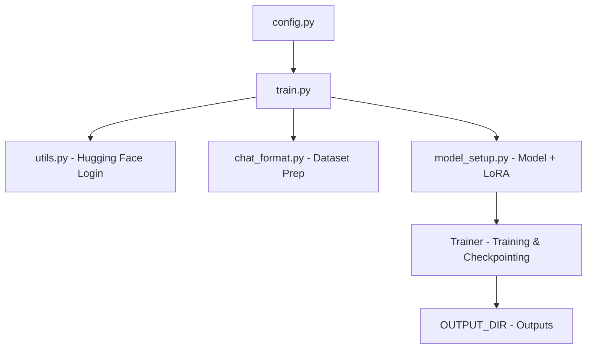

<div align="center">

# 🌏 **Camtour-AI**
### 🧠 Fine-tuning Mistral with LoRA + 4-bit Quantization (QLoRA)

A compact and modular pipeline for **efficiently fine-tuning Mistral-family causal language models** using **PEFT (LoRA)** and **BitsAndBytes 4-bit quantization** — built for Colab, local, or lightweight GPU environments.

---

[](https://www.python.org/)
[](https://huggingface.co/docs/transformers)
[](LICENSE)
[](https://github.com/huggingface/peft)
[](https://github.com/TimDettmers/bitsandbytes)

</div>

---

## 📖 Overview

**Camtour-AI** provides a plug-and-play pipeline to fine-tune **Mistral-based causal LMs** using:
- 🧠 Hugging Face **Transformers**
- ⚙️ **PEFT** (Parameter-Efficient Fine-Tuning via LoRA)
- 💾 **BitsAndBytes (4-bit quantization)**
- 🧩 **Datasets** for data loading and preprocessing
- 🧪 **Trainer API** for orchestration

> ⚠️ Recommended for cloud or Colab GPU (T4/V100/A100). Local GPUs may not have enough memory.

---

## 🧱 Project Structure

| File / Folder | Description |
|----------------|-------------|
| `README.md` | This guide |
| `requirements.txt` | Dependency list |
| `src/train.py` | 🚀 Main training entrypoint |
| `src/model_setup.py` | Model loading, LoRA config, quantization setup |
| `src/config.py` | Centralized configuration (model, paths, hyperparams) |
| `src/utils.py` | Helper functions (login, summaries) |
| `src/chat_format.py` | Dataset loader, formatter, tokenizer |
| `notebook/Trainer.ipynb` | Interactive notebook (ideal for Colab) |
| `data/` | Directory for your datasets |

---

## ⚙️ Requirements

Example dependencies from `requirements.txt`:

```text
torch==2.1.2
transformers==4.36.2
datasets==2.15.0
accelerate==0.25.0
peft==0.7.1
bitsandbytes==0.41.3
trl
scipy
tensorboardx
flash-attn
````

**Install (Linux/macOS):**

```bash
python -m venv .venv
source .venv/bin/activate
pip install --upgrade pip
pip install -r requirements.txt
```

> 💡 **Notes**
>
> * Match your PyTorch **CUDA version** before installing.
> * If `bitsandbytes` fails, follow [official installation instructions](https://github.com/TimDettmers/bitsandbytes#installation).

---

## ⚡ Quick Start

### 1️⃣ Configure

Edit `src/config.py`:

```python
HF_TOKEN = "your_hf_token_here"
BASE_MODEL = "mistralai/Mistral-7B-Instruct-v0.3"
DATA_PATH = "data/train-dataset/*.json"
OUTPUT_DIR = "outputs/mistral-lora"
```

Alternatively, modify `src/utils.py` to load environment variables.

---

### 2️⃣ Prepare Your Dataset

Expected structure:

```
data/
├── train-dataset/
│   ├── train.json
│   └── ...
└── test/
    └── test.json
```

Each JSON entry should include a `prompt` and `response` field (or match the schema expected by `chat_format.py`).

---

### 3️⃣ Run Training

From the repo root:

```bash
python src/train.py
```

This will:

1. 🔐 Log in to Hugging Face (`HF_TOKEN`)
2. 📦 Load and tokenize data (`src/chat_format.py`)
3. 🧠 Prepare the base model + LoRA (`src/model_setup.py`)
4. 🏋️‍♂️ Launch fine-tuning via `transformers.Trainer`

---

## 🧩 Configuration Reference

| Variable            | Description                                                  |
| ------------------- | ------------------------------------------------------------ |
| `HF_TOKEN`          | Hugging Face authentication token                            |
| `BASE_MODEL`        | Base model name (e.g., `mistralai/Mistral-7B-Instruct-v0.3`) |
| `DATA_PATH`         | Path or glob to training data                                |
| `RESUME_MODEL_PATH` | Resume from existing LoRA checkpoint                         |
| `OUTPUT_DIR`        | Save directory for checkpoints & final model                 |
| `bnb_config`        | BitsAndBytes quantization configuration                      |
| `training_args`     | `TrainingArguments` for `Trainer`                            |

> 🧩 Configuration can be environment-driven — easily set via `os.environ`.

---

## 🧠 Training Flow



---

## 📦 Outputs

Fine-tuned model checkpoints and logs are saved in your `OUTPUT_DIR`.

Save frequency is determined by:

```python
training_args.save_strategy
```

Example output structure:

```
outputs/
├── checkpoint-500/
├── checkpoint-1000/
└── final/
```

---

## 🧯 Troubleshooting

| Issue                             | Solution                                                            |
| --------------------------------- | ------------------------------------------------------------------- |
| ❌ **CUDA OOM**                    | Lower `per_device_train_batch_size` or enable gradient accumulation |
| ⚠️ **bitsandbytes install error** | Use platform-specific wheel or follow official docs                 |
| 🔑 **HF login fails**             | Check token in `HF_TOKEN` or use `huggingface-cli login`            |
| 💾 **Resume checkpoint error**    | Clear `RESUME_MODEL_PATH` or verify LoRA checkpoint validity        |
| 🧮 **Colab GPU issues**           | Use T4, P100, V100, or A100 for stable performance                  |

---

## 🧭 Development Roadmap

* [ ] ✨ Add inference script for LoRA model generation
* [ ] 🧪 Include unit tests for `chat_format.py`
* [ ] ⚙️ Support environment-based configuration

---

## 🧑‍💻 Author & License

**Author:** LY Chhaythean *(Zhang Jiang)*
**License:** [MIT License](LICENSE)

---

<div align="center">

> *“Train efficiently. Fine-tune wisely. Generate beautifully.”* ✨
> **Camtour-AI — lightweight fine-tuning for smarter travel AI.**

</div>